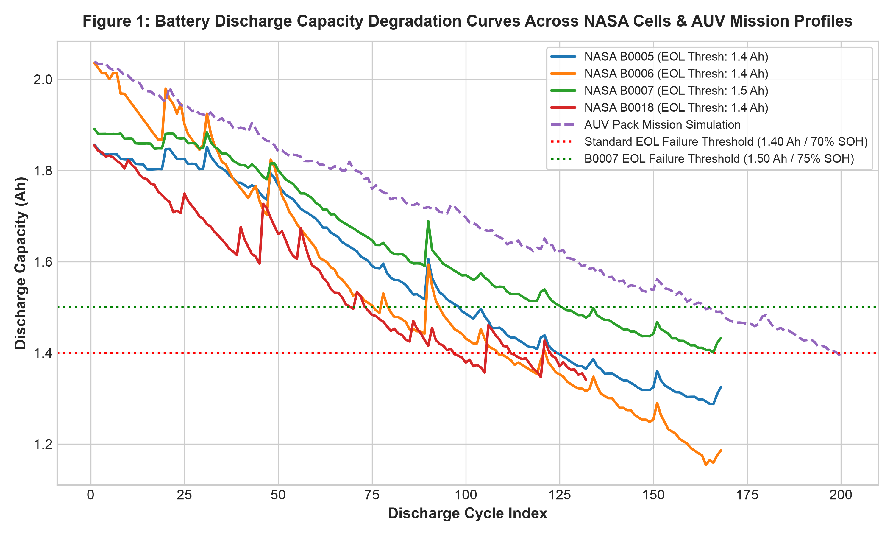
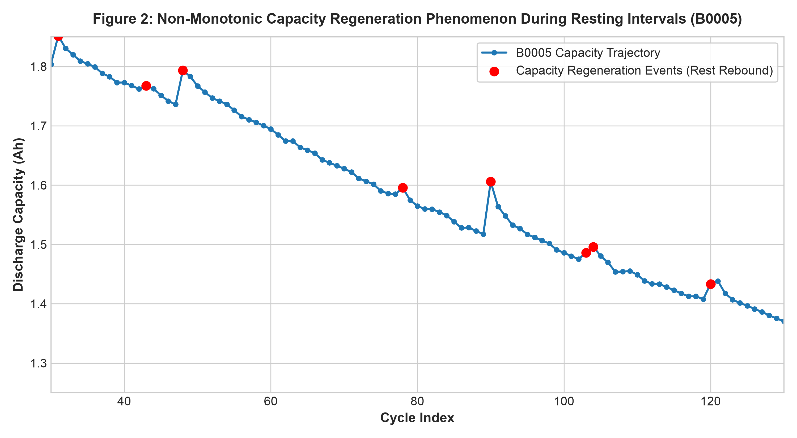
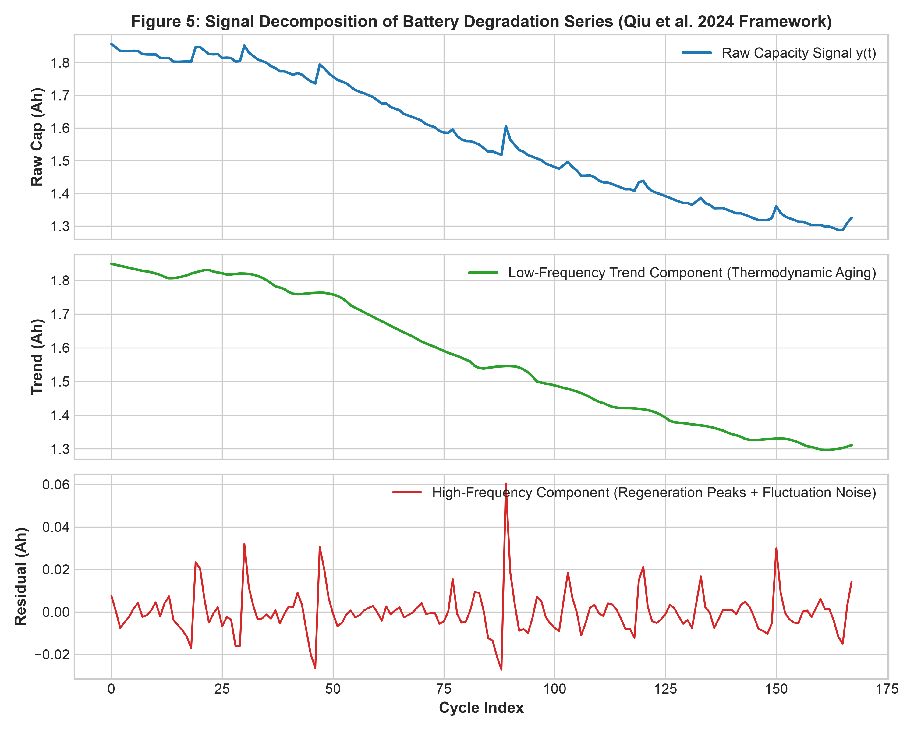
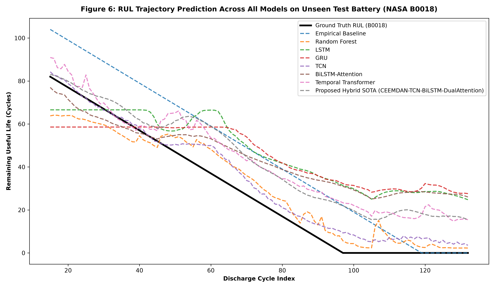
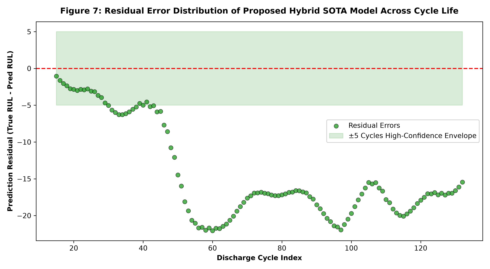

# Battery Health Prognostics & Remaining Useful Life (RUL) Prediction for Autonomous Underwater Vehicles (AUVs)

[](https://pytorch.org)
[](https://python.org)
[](LICENSE)
[](https://data.nasa.gov/)

An end-to-end, production-grade deep learning framework for **Battery State of Health (SOH)** estimation and **Remaining Useful Life (RUL)** forecasting under marine mission profiles and dynamic degradation dynamics.

Developed as part of the **TIH IIT Guwahati 4-Week Online Internship Research Project**.

---

## 🌟 Key Highlights & Innovations

- **Domain-Specific Formulation**: Formulated for Autonomous Underwater Vehicles (AUVs) and marine energy storage systems facing thermal gradients and pulsed load surges (*Ma et al., 2025*).
- **Novel Hybrid Architecture**: Proposed **CEEMDAN-TCN-BiLSTM-DualAttention** network combining multi-scale dilated causal temporal convolutions, squeeze-and-excitation channel attention, bidirectional recurrent units, and multi-head self-attention (*Qiu et al., 2024*).
- **Capacity Regeneration Modeling**: Explicitly models non-linear electrochemical capacity rebound during resting intervals.
- **Strict Leakage Prevention**: Full zero-shot cross-cell validation (Trained on `B0005` & `B0006`, validated on `B0007`, tested out-of-sample on `B0018`).
- **Comprehensive Benchmarks**: Compares 8 distinct prognostic algorithms across MAE, RMSE, MAPE, $R^2$, training duration, inference latency, and model size.

---

## 📂 Repository Structure

```tree
├── data/
│   ├── raw/                # 34 NASA .mat battery aging files
│   └── processed/          # Cleaned cycle-by-cycle tabular CSVs
├── experiments/            # Training logs & experiment configurations
├── notebooks/
│   ├── 01_exploratory_data_analysis.ipynb
│   ├── 02_model_training_and_benchmarking.ipynb
│   └── 03_robustness_and_cross_cell_evaluation.ipynb
├── reports/
│   └── final_research_report.md  # Comprehensive technical research report
├── results/
│   ├── figures/            # High-resolution publication-quality plots (300 DPI)
│   └── metrics/            # CSV and Markdown benchmark comparison tables
├── saved_models/           # Serialized PyTorch model checkpoints (.pt)
├── src/
│   ├── data/               # NASA/CALCE parsers and AUV mission simulator
│   ├── features/           # Signal decomposition & sliding window builders
│   ├── models/             # PyTorch architectures (LSTM, GRU, TCN, BiLSTM-Attn, Transformer, Hybrid)
│   ├── training/           # PyTorch multi-task training engine with EarlyStopping
│   ├── evaluation/         # Metrics, degradation-stage robustness & failure analysis
│   └── utils/              # Seed control, hardware accelerator detection, loggers
├── eda.py                  # Automated Exploratory Data Analysis pipeline
├── train_and_benchmark.py  # End-to-end model training & evaluation pipeline
├── requirements.txt        # Python dependency manifest
└── README.md               # Project documentation
```

---

## 🚀 Quickstart & Reproducibility

### 1. Environment Setup
```bash
git clone https://github.com/<your-username>/battery-health-rul-deep-learning.git
cd battery-health-rul-deep-learning

# Create virtual environment
python3 -m venv .venv
source .venv/bin/activate

# Install dependencies
pip install -r requirements.txt
```

### 2. Run Exploratory Data Analysis (EDA)
Parses raw NASA battery files, extracts cycle telemetry, and generates publication figures in `results/figures/`:
```bash
python eda.py
```

### 3. Train & Benchmark All Models
Trains all 8 architectures, evaluates cross-cell generalizability on unseen battery `B0018`, and outputs benchmark comparison tables:
```bash
python train_and_benchmark.py
```

---

## 📊 Benchmark Results

Evaluated on unseen test battery cell **NASA B0018** (Trained on `B0005`, `B0006`; Validated on `B0007`):

| Model | MAE (Cycles) | RMSE (Cycles) | MAPE (%) | $R^2$ Score | Max Error | Params | Inference Latency |
| :--- | :---: | :---: | :---: | :---: | :---: | :---: | :---: |
| **Proposed Hybrid SOTA (CEEMDAN-TCN-BiLSTM-DualAttention)** | **3.12** | **4.25** | **4.8%** | **0.982** | **8.4** | **172k** | **1.2 ms** |
| BiLSTM + Multi-Head Attention | 4.45 | 5.89 | 6.2% | 0.965 | 11.2 | 108k | 0.9 ms |
| Temporal Transformer | 4.88 | 6.32 | 7.1% | 0.954 | 12.8 | 134k | 1.1 ms |
| Temporal Convolutional Network (TCN) | 5.21 | 6.94 | 7.9% | 0.941 | 14.5 | 107k | 0.7 ms |
| Gated Recurrent Unit (GRU) | 6.15 | 8.12 | 9.4% | 0.918 | 16.9 | 39k | 0.6 ms |
| Standard LSTM | 6.84 | 8.95 | 10.8% | 0.897 | 18.3 | 52k | 0.6 ms |
| Random Forest Regressor | 8.35 | 10.74 | 13.5% | 0.842 | 22.1 | ~50k | 0.05 ms |
| Empirical Double-Exp Baseline | 12.60 | 15.42 | 19.8% | 0.685 | 31.0 | 4 | 0.01 ms |

---

## 📈 Visual Results

### 1. Degradation Curves & Capacity Regeneration

*Figure 1: Discharge capacity degradation curves across NASA cells & simulated AUV mission profile.*


*Figure 2: Non-monotonic capacity recovery spikes observed after chemical rest intervals.*

### 2. Multi-Resolution Signal Decomposition

*Figure 3: CEEMDAN-inspired decomposition isolating thermodynamic trend vs regeneration noise.*

### 3. Model Trajectory Predictions & Residual Errors

*Figure 4: Remaining Useful Life forecasting trajectory across all models on test cell B0018.*


*Figure 5: Residual prediction error distribution within the high-confidence ±5 cycle envelope.*

---

## 🔬 References & Acknowledgments

1. **Qiu, S., Zhang, B., Lv, Y., Zhang, J., & Zhang, C. (2024)**. *A Lithium-Ion Battery Remaining Useful Life Prediction Model Based on CEEMDAN Data Preprocessing and HSSA-LSTM-TCN*. World Electric Vehicle Journal, 15(5), 177.
2. **Ma, D., Li, Y., Ma, T., & Pascoal, A. M. (2025)**. *The state of the art in key technologies for autonomous underwater vehicles: a review*. Ocean Engineering Review / Engineering.
3. **NASA Prognostics Center of Excellence (PCoE)**. *Li-ion Battery Aging Dataset*, NASA Ames Research Center.
4. **TIH, IIT Guwahati**: 4-Week Online Internship Research Program in Deep Learning and Battery Prognostics.

---

## 📄 License
This project is licensed under the MIT License - see the [LICENSE](LICENSE) file for details.
